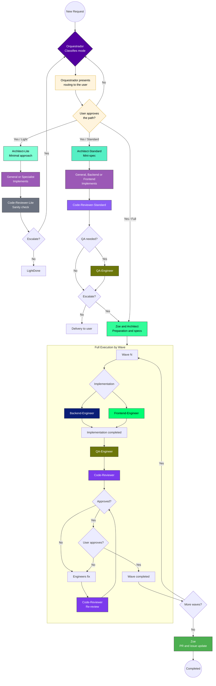

```mermaid
graph TD
    Start((New Request)) --> Router{Orquestrador<br/>Classifies mode}
    Router --> RouteApproval[Orquestrador presents<br/>routing to the user]
    RouteApproval --> UserRouteApproval{User approves<br/>the path?}
    UserRouteApproval -- "No" --> Router
    UserRouteApproval -- "Yes / Light" --> LightArch[Architect-Lite<br/>Minimal approach]
    LightArch --> LightExec[General or Specialist<br/>Implements]
    LightExec --> LiteCR[Code-Reviewer-Lite<br/>Sanity check]
    LiteCR --> LightEscalate{Escalate?}
    LightEscalate -- "No" --> LightDone
    LightEscalate -- "Yes" --> Router

    UserRouteApproval -- "Yes / Standard" --> StandardArch[Architect-Standard<br/>Mini-spec]
    StandardArch --> StandardExec[General, Backend or Frontend<br/>Implements]
    StandardExec --> CRStandard[Code-Reviewer-Standard]
    CRStandard --> StandardQA{QA needed?}
    StandardQA -- "Yes" --> QA[QA-Engineer]
    StandardQA -- "No" --> StandardEscalate
    QA --> StandardEscalate{Escalate?}
    StandardEscalate -- "No" --> StandardDone[Delivery to user]
    StandardEscalate -- "Yes" --> FullPrep

    UserRouteApproval -- "Yes / Full" --> FullPrep[Zoe and Architect<br/>Preparation and specs]
    FullPrep --> WaveLoop

    subgraph WaveLoop[Full Execution by Wave]
        WaveStart[Wave N] --> Parallel{Implementation}
        Parallel --> BE[Backend-Engineer]
        Parallel --> FE[Frontend-Engineer]
        BE --> EngDone[Implementation completed]
        FE --> EngDone
        EngDone --> QAFull[QA-Engineer]
        QAFull --> CRDeep[Code-Reviewer]
        CRDeep --> CRResult{Approved?}
        CRResult -- "No" --> FixEng[Engineers fix]
        FixEng --> ReReview[Code-Reviewer<br/>Re-review]
        ReReview --> CRResult
        CRResult -- "Yes" --> UserReview{User approves?}
        UserReview -- "No" --> FixEng
        UserReview -- "Yes" --> WaveDone[Wave completed]
    end

    WaveDone --> NextWave{More waves?}
    NextWave -- "Yes" --> WaveStart
    NextWave -- "No" --> ZoeEnd[Zoe<br/>PR and issue update]
    ZoeEnd --> End((Completed))

    style Router fill:#52009e,stroke:#333,color:#fff
    style RouteApproval fill:#fff4dd,stroke:#d4a017,color:#000
    style UserRouteApproval fill:#fff4dd,stroke:#d4a017,color:#000
    style LightArch fill:#7fffd4,stroke:#333,color:#000
    style LightExec fill:#9b59b6,stroke:#333,color:#fff
    style LiteCR fill:#6b7280,stroke:#333,color:#fff
    style StandardArch fill:#55efc4,stroke:#333,color:#000
    style StandardExec fill:#9b59b6,stroke:#333,color:#fff
    style CRStandard fill:#8b5cf6,stroke:#333,color:#fff
    style QA fill:#6c770a,stroke:#333,color:#fff
    style QAFull fill:#6c770a,stroke:#333,color:#fff
    style CRDeep fill:#7c3aed,stroke:#333,color:#fff
    style ReReview fill:#7c3aed,stroke:#333,color:#fff
    style BE fill:#0a1e77,stroke:#333,color:#fff
    style FE fill:#00ff73,stroke:#333,color:#000
    style FullPrep fill:#33fd9a,stroke:#333,color:#000
    style ZoeEnd fill:#4CAF50,stroke:#333,color:#fff
```
